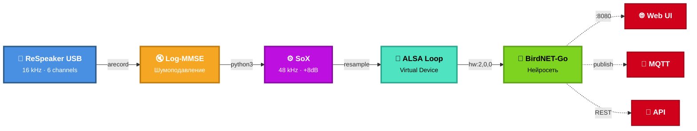

# BirdNET-ODAS

Система автоматического распознавания птиц на базе BirdNET-Go с микрофонной решеткой ReSpeaker USB 4 Mic Array и Log-MMSE шумоподавлением.

[](https://opensource.org/licenses/MIT)

## Что это

Интеграция BirdNET нейросети для распознавания птиц с профессиональным микрофонным массивом ReSpeaker и алгоритмом шумоподавления Log-MMSE. Позволяет надежно распознавать птиц в полевых условиях с высоким уровнем фонового шума.

**Основные возможности:**
- Распознавание 6000+ видов птиц (модель BirdNET GLOBAL 6K V2.4)
- Шумоподавление в реальном времени (Log-MMSE)
- Веб-интерфейс для мониторинга
- Автосохранение аудиоклипов с детекциями
- MQTT интеграция для Home Assistant
- Географическая фильтрация видов
- Круглосуточная работа с автовосстановлением

## Требования

**Железо:**
- Raspberry Pi 4/5 (4GB+ RAM) или NanoPi M4B
- [ReSpeaker USB Mic Array v2.0](https://www.seeedstudio.com/ReSpeaker-Mic-Array-v2-0.html)
- MicroSD 16GB+ (лучше 32GB)
- Питание 5V/3A

**Софт:**
- Linux (Debian/Ubuntu)
- Docker + Docker Compose
- ALSA
- Python 3.8+
- SoX

## Быстрый старт

```bash
git clone https://github.com/Gfermoto/birdnet_odas.git
cd birdnet_odas
```

**Raspberry Pi:**
```bash
cd platforms/raspberry-pi
sudo bash setup.sh
```

**NanoPi M4B:**
```bash
cd platforms/nanopi-m4b  
sudo bash setup.sh
```

Скрипт сам установит Docker, настроит ReSpeaker, создаст аудио пайплайн и запустит BirdNET-Go. После установки веб-интерфейс доступен на `http://<IP>:8080`.

## Архитектура



**Ключевые параметры:**
- Buffer: 32768 samples (для стабильности)
- Gain: +8.0 dB
- MIN_GAIN: 0.15 (оптимально для птиц)
- Threshold: 0.65 (баланс точность/чувствительность)
- Retention: 30 дней, автоочистка при 80% диска

## Обслуживание

Проверка статуса:
```bash
systemctl status respeaker-loopback.service
docker ps
ps aux | grep -E "arecord|log_mmse|sox|aplay" | grep -v grep  # должно быть 4 процесса
```

Логи:
```bash
journalctl -fu respeaker-loopback.service
docker logs -f birdnet-go
tail -f /var/log/birdnet-pipeline/errors.log
```

Перезапуск:
```bash
sudo systemctl restart respeaker-loopback.service
docker compose restart
```

## Производительность

На Raspberry Pi 4:
- CPU: 20-30%
- RAM: 400-600 MB
- Latency: <500ms
- Accuracy: 85-95% (зависит от условий)

## Документация

- [Руководство по установке](docs/INSTALLATION.md)
- [Руководство по настройке](docs/CONFIGURATION.md)
- [Решение проблем](docs/troubleshooting.md)
- [Настройка ReSpeaker](docs/respeaker_usb4mic_setup.md)
- [Аудио пайплайн](docs/audio_pipeline.md)
- [Настройка BirdNET-Go](docs/birdnet_go_setup.md)

Детальная статья о проекте: [article.md](article.md)

## Вклад

Pull requests приветствуются. Для крупных изменений сначала откройте issue. См. [CONTRIBUTING.md](CONTRIBUTING.md).

## Лицензия

MIT - см. [LICENSE](LICENSE)

## Благодарности

- [BirdNET-Go](https://github.com/tphakala/birdnet-go) - tphakala
- [Seeed Studio](https://www.seeedstudio.com/) - ReSpeaker
- Ephraim & Malah - Log-MMSE algorithm

## Issues

[GitHub Issues](https://github.com/Gfermoto/birdnet_odas/issues)
