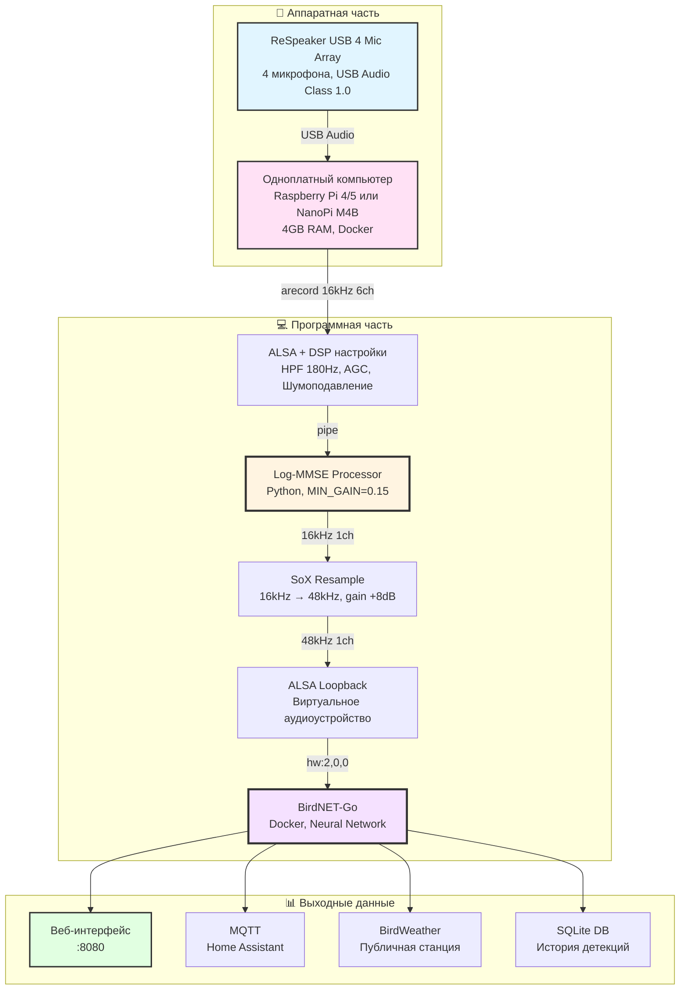
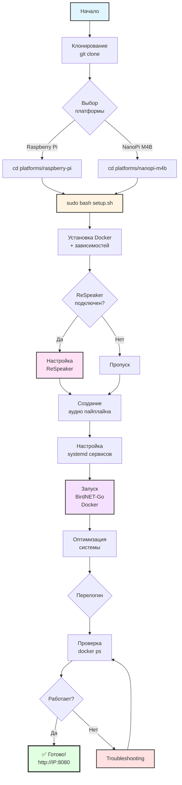
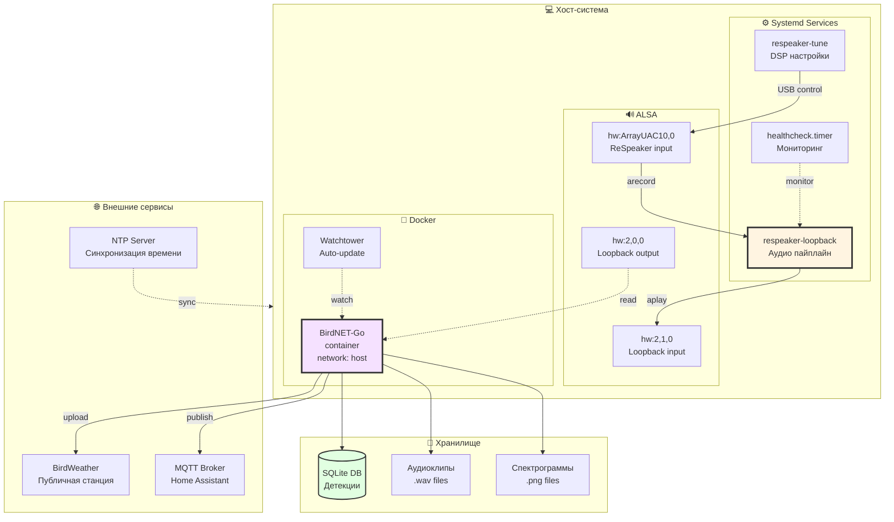

# Диаграммы для статьи

## Архитектура системы (общая)



## Аудио пайплайн (детальный)

```mermaid
flowchart LR
    subgraph Input["📥 Вход"]
        A[ReSpeaker USB<br/>16 kHz<br/>6 каналов<br/>interleaved]
    end
    
    subgraph Processing["⚙️ Обработка"]
        B[arecord<br/>Захват аудио<br/>buffer: 32768]
        C[Log-MMSE<br/>Шумоподавление<br/>STFT 1024<br/>MIN_GAIN: 0.15]
        D[SoX<br/>Resample 48kHz<br/>Gain: +8dB<br/>Quality: very high]
        E[aplay<br/>Loopback write<br/>hw:2,1,0]
    end
    
    subgraph Loopback["🔄 Loopback"]
        F[ALSA Loopback<br/>snd-aloop<br/>48 kHz<br/>mono]
    end
    
    subgraph Recognition["🧠 Распознавание"]
        G[BirdNET-Go<br/>Docker<br/>Threshold: 0.7<br/>Overlap: 1.5s]
    end
    
    subgraph Output["📤 Выход"]
        H[Детекции<br/>+ аудиоклипы<br/>+ спектрограммы]
    end
    
    A -->|pipe| B
    B -->|stdout| C
    C -->|stdout| D
    D -->|stdout| E
    E -->|write| F
    F -->|hw:2,0,0| G
    G --> H
    
    style A fill:#e1f5ff,stroke:#333,stroke-width:2px
    style C fill:#fff4e1,stroke:#333,stroke-width:3px
    style D fill:#ffe1e1,stroke:#333,stroke-width:2px
    style F fill:#e1ffe1,stroke:#333,stroke-width:2px
    style G fill:#f5e1ff,stroke:#333,stroke-width:3px
    style H fill:#e1f5e1,stroke:#333,stroke-width:2px
```



## Log-MMSE алгоритм (упрощенно)

```mermaid
flowchart TD
    A[Входной аудиосигнал<br/>16 kHz, mono] --> B[STFT<br/>Окно Ханна<br/>Frame: 1024<br/>Hop: 512]
    B --> C{Обучение?<br/>Первые 15 кадров}
    C -->|Да| D[Оценка PSD шума<br/>λ&#40;ω&#41; = mean&#40;|Y&#40;ω,t&#41;|²&#41;]
    C -->|Нет| E[Вычисление SNR<br/>γ = |Y|² / λ<br/>ξ = α×G²×γ + &#40;1-α&#41;×max&#40;γ-1, 0&#41;]
    D --> E
    E --> F[Log-MMSE Gain<br/>G = &#40;ξ/&#40;1+ξ&#41;&#41; × exp&#40;0.5×E₁&#40;ν&#41;&#41;]
    F --> G[Применение усиления<br/>Ŷ = G × Y]
    G --> H[Soft Limiter<br/>tanh&#40;x × 0.95&#41;]
    H --> I[ISTFT<br/>Overlap-add<br/>Нормализация]
    I --> J[Выходной сигнал<br/>16 kHz, mono]
    
    style A fill:#e1f5ff,stroke:#333,stroke-width:2px
    style B fill:#ffe1f5,stroke:#333,stroke-width:2px
    style F fill:#fff4e1,stroke:#333,stroke-width:3px
    style H fill:#ffe1e1,stroke:#333,stroke-width:2px
    style J fill:#e1ffe1,stroke:#333,stroke-width:2px
```

## Процесс установки



## Архитектура микросервисов



Эти диаграммы можно использовать в:
- README.md (общая архитектура)
- article.md (все диаграммы)
- docs/audio_pipeline.md (детальный пайплайн)
- docs/INSTALLATION.md (процесс установки)
