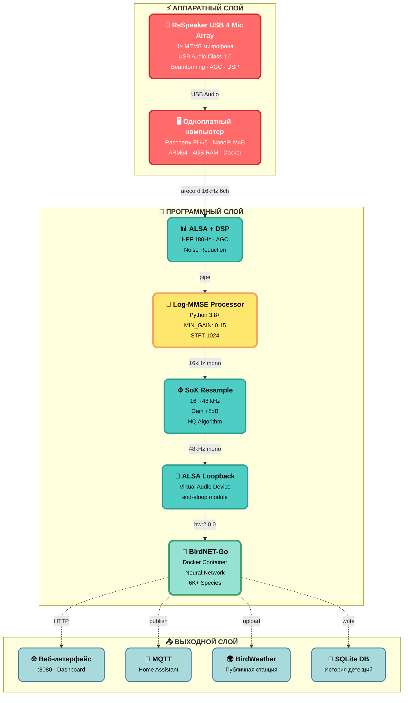
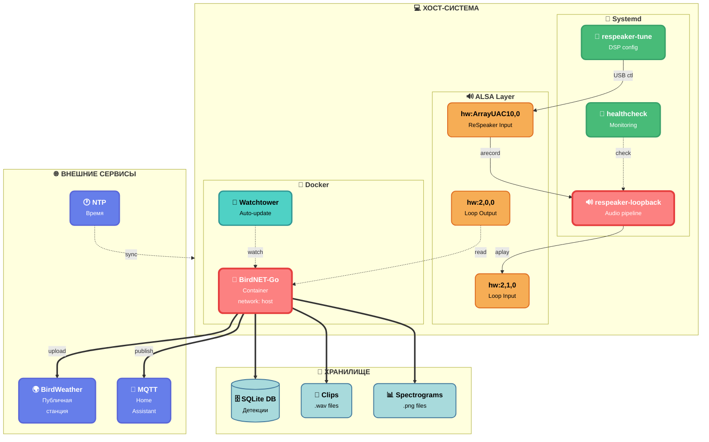

# Диаграммы проекта

Профессиональные диаграммы для визуализации архитектуры и процессов системы BirdNET-ODAS.

---

## 1. Архитектура системы (общая)



---

## 2. Аудио пайплайн (детальный)

```mermaid
%%{init: {'theme':'base', 'themeVariables': { 'fontSize':'14px', 'fontFamily':'system-ui, -apple-system, "Segoe UI", Roboto, sans-serif'}}}%%
flowchart LR
    subgraph IN["<b>📥 INPUT</b>"]
        direction TB
        A["<b>🎤 ReSpeaker USB</b><br/><small>16 kHz<br/>6 channels<br/>interleaved</small>"]
    end
    
    subgraph PROC["<b>⚙️ PROCESSING PIPELINE</b>"]
        direction TB
        B["<b>1️⃣ arecord</b><br/><small>Audio Capture<br/>buffer: 32768</small>"]
        C["<b>2️⃣ Log-MMSE</b><br/><small>Noise Reduction<br/>STFT 1024<br/>MIN_GAIN: 0.15</small>"]
        D["<b>3️⃣ SoX</b><br/><small>Resample 48kHz<br/>Gain: +8dB<br/>Quality: VHQ</small>"]
        E["<b>4️⃣ aplay</b><br/><small>Loopback Write<br/>hw:2,1,0</small>"]
    end
    
    subgraph LOOP["<b>🔄 VIRTUAL</b>"]
        direction TB
        F["<b>🔁 ALSA Loopback</b><br/><small>snd-aloop<br/>48 kHz · mono</small>"]
    end
    
    subgraph AI["<b>🧠 RECOGNITION</b>"]
        direction TB
        G["<b>🤖 BirdNET-Go</b><br/><small>Docker<br/>Threshold: 0.7<br/>Overlap: 1.5s</small>"]
    end
    
    subgraph OUTDATA["<b>📤 OUTPUT</b>"]
        direction TB
        H["<b>📊 Детекции</b><br/><small>+ clips<br/>+ spectrograms</small>"]
    end
    
    A ==>|"<small>pipe</small>"| B
    B ==>|"<small>stdout</small>"| C
    C ==>|"<small>stdout</small>"| D
    D ==>|"<small>stdout</small>"| E
    E ==>|"<small>write</small>"| F
    F ==>|"<small>hw:2,0,0</small>"| G
    G ==>|"<small>save</small>"| H
    
    classDef input fill:#667EEA,stroke:#5A67D8,stroke-width:3px,color:#fff,rx:12,ry:12
    classDef capture fill:#48BB78,stroke:#38A169,stroke-width:3px,color:#fff,rx:12,ry:12
    classDef core fill:#F6AD55,stroke:#DD6B20,stroke-width:4px,color:#000,rx:12,ry:12
    classDef convert fill:#FC8181,stroke:#E53E3E,stroke-width:3px,color:#fff,rx:12,ry:12
    classDef virtual fill:#4FD1C5,stroke:#319795,stroke-width:3px,color:#000,rx:12,ry:12
    classDef ai fill:#9F7AEA,stroke:#805AD5,stroke-width:4px,color:#fff,rx:12,ry:12
    classDef output fill:#68D391,stroke:#48BB78,stroke-width:3px,color:#000,rx:12,ry:12
    
    class A input
    class B capture
    class C core
    class D convert
    class E capture
    class F virtual
    class G ai
    class H output
```



---

## 3. Log-MMSE алгоритм

```mermaid
%%{init: {'theme':'base', 'themeVariables': { 'fontSize':'14px', 'fontFamily':'system-ui, -apple-system, "Segoe UI", Roboto, sans-serif'}}}%%
flowchart TD
    START["<b>▶️ Входной аудиосигнал</b><br/><small>16 kHz · mono</small>"]
    STFT["<b>📊 STFT</b><br/><small>Hann Window<br/>Frame: 1024<br/>Hop: 512</small>"]
    CHECK{{"<b>⚡ Обучение?</b><br/><small>Первые 15 кадров</small>"}}
    NOISE["<b>🔍 Оценка шума</b><br/><small>λ(ω) = mean(|Y(ω,t)|²)</small>"]
    SNR["<b>📈 SNR расчет</b><br/><small>γ = |Y|² / λ<br/>ξ = α×G²×γ + (1-α)×max(γ-1,0)</small>"]
    GAIN["<b>🎯 Log-MMSE Gain</b><br/><small>G = (ξ/(1+ξ)) × exp(0.5×E₁(ν))</small>"]
    APPLY["<b>✨ Применение</b><br/><small>Ŷ = G × Y</small>"]
    LIMIT["<b>🛡️ Soft Limiter</b><br/><small>tanh(x × 0.95)</small>"]
    ISTFT["<b>🔄 ISTFT</b><br/><small>Overlap-add<br/>Нормализация</small>"]
    END["<b>✅ Выходной сигнал</b><br/><small>16 kHz · mono</small>"]
    
    START ==> STFT
    STFT ==> CHECK
    CHECK ==>|"<small>ДА</small>"| NOISE
    CHECK ==>|"<small>НЕТ</small>"| SNR
    NOISE ==> SNR
    SNR ==> GAIN
    GAIN ==> APPLY
    APPLY ==> LIMIT
    LIMIT ==> ISTFT
    ISTFT ==> END
    
    classDef start fill:#667EEA,stroke:#5A67D8,stroke-width:3px,color:#fff,rx:12,ry:12
    classDef process fill:#48BB78,stroke:#38A169,stroke-width:3px,color:#fff,rx:12,ry:12
    classDef decision fill:#F6AD55,stroke:#DD6B20,stroke-width:3px,color:#000,rx:12,ry:12
    classDef core fill:#FC8181,stroke:#E53E3E,stroke-width:4px,color:#fff,rx:12,ry:12
    classDef protect fill:#9F7AEA,stroke:#805AD5,stroke-width:3px,color:#fff,rx:12,ry:12
    classDef end fill:#68D391,stroke:#48BB78,stroke-width:3px,color:#000,rx:12,ry:12
    
    class START start
    class STFT,NOISE,SNR,APPLY,ISTFT process
    class CHECK decision
    class GAIN core
    class LIMIT protect
    class END end
```

---

## 4. Процесс установки

```mermaid
%%{init: {'theme':'base', 'themeVariables': { 'fontSize':'13px', 'fontFamily':'system-ui, -apple-system, "Segoe UI", Roboto, sans-serif'}}}%%
flowchart TD
    START(["<b>🚀 НАЧАЛО</b>"])
    CLONE["<b>📦 Клонирование</b><br/><small>git clone repo</small>"]
    CHOICE{{"<b>🖥️ Платформа?</b>"}}
    RPI["<b>🍓 Raspberry Pi</b><br/><small>cd platforms/raspberry-pi</small>"]
    NANO["<b>🔷 NanoPi M4B</b><br/><small>cd platforms/nanopi-m4b</small>"]
    SETUP["<b>⚙️ Запуск setup.sh</b><br/><small>sudo bash setup.sh</small>"]
    DEPS["<b>📥 Установка зависимостей</b><br/><small>Docker · Python · SoX · ALSA</small>"]
    CHECK{{"<b>🎤 ReSpeaker?</b>"}}
    RESP["<b>🔧 Настройка ReSpeaker</b><br/><small>DSP · Tuning · udev</small>"]
    SKIP["<b>⏭️ Пропуск</b>"]
    PIPE["<b>🔊 Аудио пайплайн</b><br/><small>Log-MMSE · SoX · Loopback</small>"]
    SRVS["<b>🔄 Systemd сервисы</b><br/><small>respeaker-tune<br/>respeaker-loopback</small>"]
    DOCKER["<b>🐳 BirdNET-Go Docker</b><br/><small>docker-compose up -d</small>"]
    OPT["<b>🎯 Оптимизация</b><br/><small>Permissions · USB · Timezone</small>"]
    RELOG{{"<b>🔄 Перелогин</b>"}}
    VERIFY["<b>✅ Проверка</b><br/><small>docker ps<br/>systemctl status</small>"]
    WORKS{{"<b>💚 Работает?</b>"}}
    SUCCESS(["<b>🎉 ГОТОВО!</b><br/><small>http://IP:8080</small>"])
    TROUBLE["<b>⚠️ Troubleshooting</b><br/><small>Логи · Диагностика</small>"]
    
    START ==> CLONE
    CLONE ==> CHOICE
    CHOICE ==>|"<small>RPI</small>"| RPI
    CHOICE ==>|"<small>Nano</small>"| NANO
    RPI ==> SETUP
    NANO ==> SETUP
    SETUP ==> DEPS
    DEPS ==> CHECK
    CHECK ==>|"<small>ДА</small>"| RESP
    CHECK ==>|"<small>НЕТ</small>"| SKIP
    RESP ==> PIPE
    SKIP ==> PIPE
    PIPE ==> SRVS
    SRVS ==> DOCKER
    DOCKER ==> OPT
    OPT ==> RELOG
    RELOG ==> VERIFY
    VERIFY ==> WORKS
    WORKS ==>|"<small>ДА</small>"| SUCCESS
    WORKS ==>|"<small>НЕТ</small>"| TROUBLE
    TROUBLE ==> VERIFY
    
    classDef start fill:#667EEA,stroke:#5A67D8,stroke-width:4px,color:#fff,rx:15,ry:15
    classDef action fill:#48BB78,stroke:#38A169,stroke-width:3px,color:#fff,rx:10,ry:10
    classDef decision fill:#F6AD55,stroke:#DD6B20,stroke-width:3px,color:#000,rx:10,ry:10
    classDef important fill:#FC8181,stroke:#E53E3E,stroke-width:3px,color:#fff,rx:10,ry:10
    classDef success fill:#68D391,stroke:#48BB78,stroke-width:4px,color:#000,rx:15,ry:15
    classDef trouble fill:#FBD38D,stroke:#D69E2E,stroke-width:3px,color:#000,rx:10,ry:10
    
    class START,SUCCESS start
    class CLONE,DEPS,PIPE,SRVS,OPT,VERIFY action
    class CHOICE,CHECK,RELOG,WORKS decision
    class RPI,NANO,RESP,SETUP,DOCKER important
    class SKIP,TROUBLE trouble
```



---

## 5. Архитектура микросервисов



---

## Использование

Эти диаграммы используются в следующих документах:

- **README.md** - упрощенная архитектура (диаграмма из README)
- **article.md** - общая архитектура и детальный пайплайн (диаграммы 1 и 2)
- **docs/audio_pipeline.md** - детальный пайплайн и Log-MMSE (диаграммы 2 и 3)
- **docs/INSTALLATION.md** - процесс установки (диаграмма 4)
- **docs/CONFIGURATION.md** - архитектура микросервисов (диаграмма 5)
