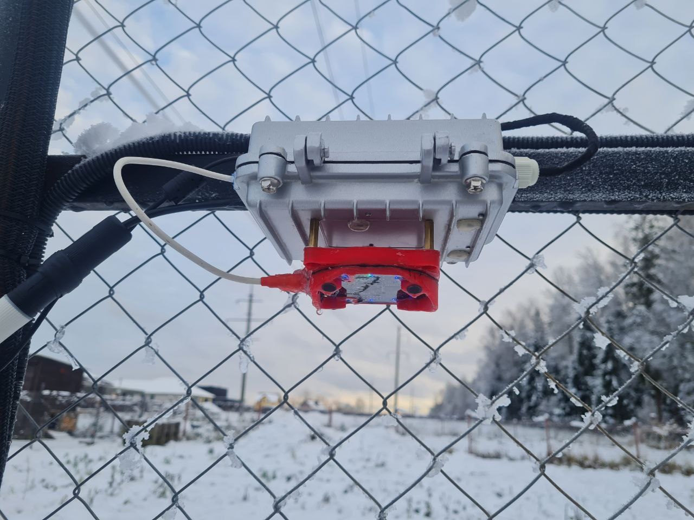
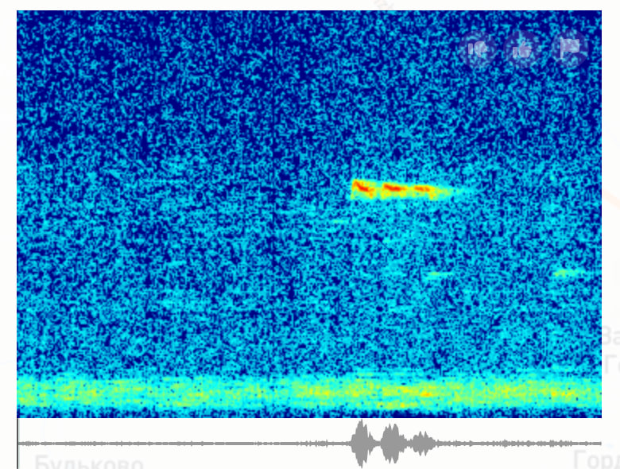
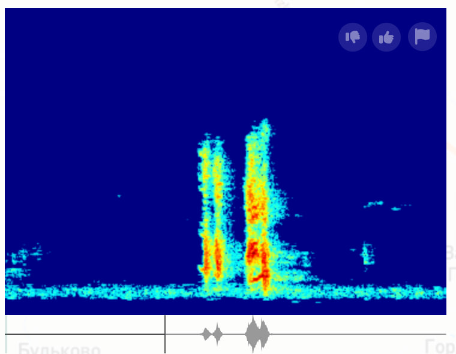

# Изображения проекта

## Устройство

## BirdNET-Go Dashboard

## Результаты обработки звука

### Сравнение качества записи

Ниже представлены спектрограммы, демонстрирующие разницу в качестве записи птичьих голосов между обычным микрофоном и нашей системой с ODAS (Open embeddeD Audition System) и продвинутой фильтрацией.

#### Запись с обычного микрофона

На этой спектрограмме видно, что запись с обычного микрофона содержит значительное количество фонового шума и помех. Полезный сигнал (голоса птиц) смешивается с шумом, что затрудняет точное распознавание видов. Хорошо заметны артефакты записи и посторонние звуки окружающей среды.

#### Запись с ODAS и фильтрацией

Результат работы нашей системы с ODAS и многоуровневой фильтрацией впечатляет! Спектрограмма показывает значительно более чистый сигнал: фоновый шум практически устранен, голоса птиц выделяются четко и ясно. Применение beamforming, шумоподавления и адаптивной фильтрации позволило получить качественную запись, которая значительно повышает точность распознавания BirdNET. Разница очевидна — теперь система может "слышать" птиц даже в шумной среде.
